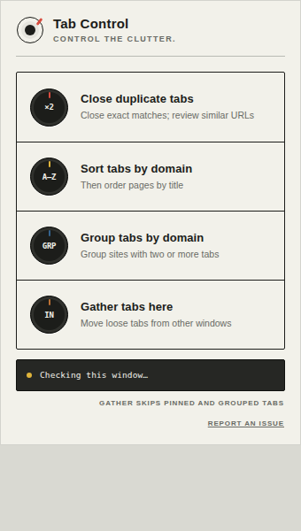

<p align="center">
  
</p>

<h1 align="center">Tab Control</h1>

<p align="center">
  <strong>Control the clutter.</strong><br />
  A dependency-free Chrome extension for cleaning and organizing tabs across
  browser windows.
</p>

<p align="center">
  
</p>

## Features

- **Close duplicates:** closes exact matches automatically and presents similar
  same-origin paths for review.
- **Sort by domain:** orders pinned and regular tabs within their respective
  sections.
- **Toggle domain groups:** creates named Chrome tab groups, then turns into an
  ungroup action.
- **Gather tabs here:** appends loose tabs from other normal windows while
  leaving pinned and grouped tabs untouched.
- **Live feedback:** reports tab, duplicate, possible-match, and site counts.

## Install from a release

1. Go to the [latest release](../../releases/latest) and download the
   `tab-control-<version>.zip` asset.
2. Create a `tab-control-<version>` folder and extract the archive into it.
3. Open `chrome://extensions`.
4. Enable **Developer mode**.
5. Select **Load unpacked**.
6. Choose the extracted `tab-control-<version>` folder.
7. Pin **Tab Control** from Chrome's extensions menu.

## Install from source

1. Download or clone this repository.
2. Open `chrome://extensions`.
3. Enable **Developer mode**.
4. Select **Load unpacked**.
5. Choose the repository folder.
6. Pin **Tab Control** from Chrome's extensions menu.

Tab groups require Chrome 89 or newer.

## Permissions

| Permission | Why it is needed |
| --- | --- |
| `tabs` | Read tab addresses and titles, close duplicates, and move tabs. |
| `tabGroups` | Name, color, create, and remove native Chrome tab groups. |

All processing happens locally. Tab Control does not collect, store, or
transmit browsing data. See [PRIVACY.md](PRIVACY.md).

## Development and releases

No dependencies or build step are required.

```sh
node --test tests/tab-logic.test.mjs
```

Every push to `main` validates and packages the extension. When the
`manifest.json` version has not already been released, the workflow tags that
commit as `v<version>` and publishes the ZIP archive on GitHub Releases. The
archive places `manifest.json` at its root, so the same package can be loaded
unpacked or uploaded to the Chrome Web Store. Chrome only supports direct local
CRX installation on Linux, so releases use the cross-platform ZIP format.

## Project structure

```text
.
├── manifest.json
├── popup.html
├── popup.css
├── popup.js
├── tab-logic.mjs
├── icons/
├── docs/
└── tests/
```

## License

[MIT](LICENSE)
