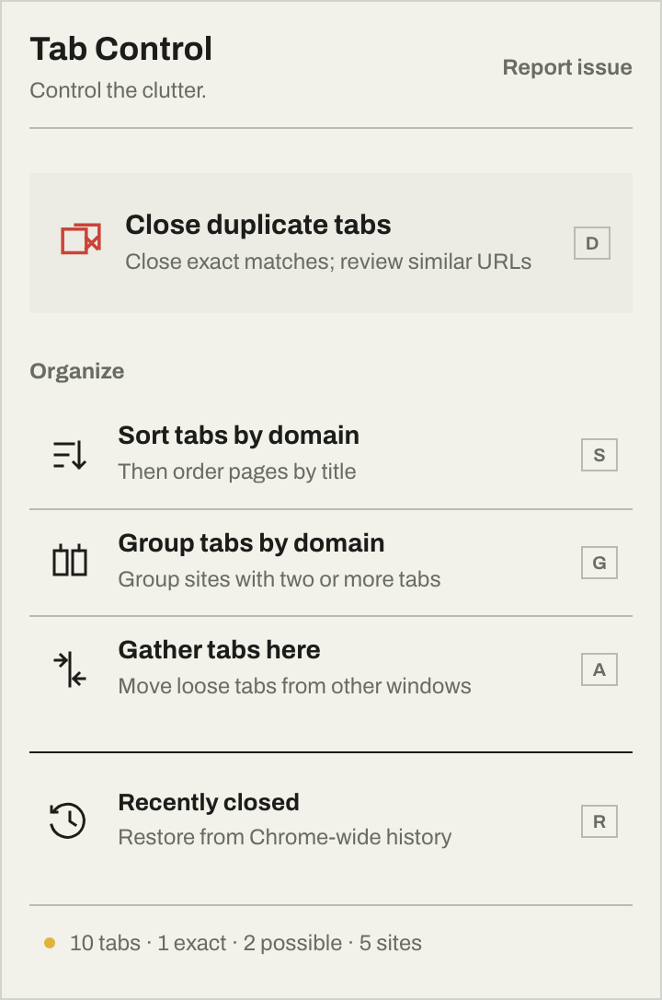
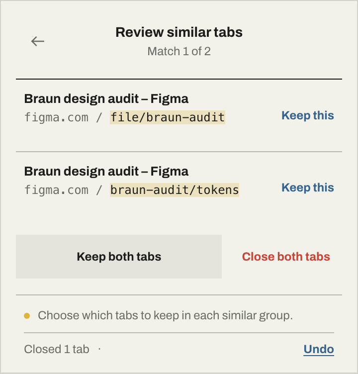
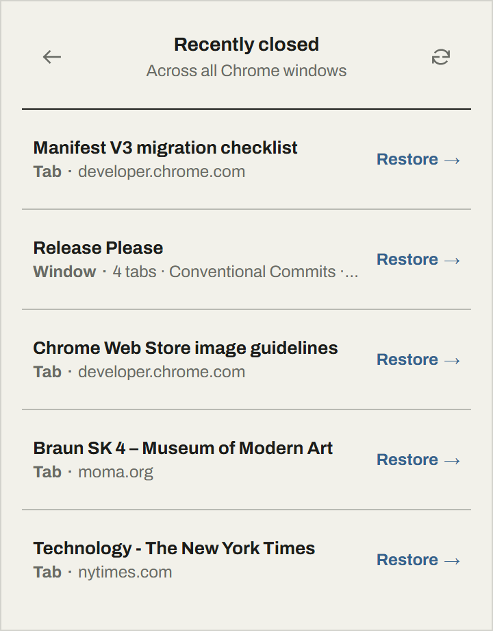

<p align="center">
  
</p>

<h1 align="center">Tab Control</h1>

<p align="center">
  <strong>Control the clutter.</strong><br />
  A dependency-free Chrome extension for cleaning and organizing tabs across
  browser windows.
</p>

<p align="center">
  
</p>

## Features

- **Close duplicates:** closes exact matches automatically and presents similar
  same-origin paths for review. Review can be stopped at any time without
  changing the remaining matches. The latest cleanup can be undone as one
  transaction until another cleanup starts or the browser session ends. Undo
  uses Chrome's session restore to preserve browsing history when available,
  with an address-only fallback for expired session entries.
- **Sort by domain:** orders pinned and regular tabs within their respective
  sections.
- **Toggle domain groups:** creates named Chrome tab groups, then turns into an
  ungroup action.
- **Gather tabs here:** appends loose tabs from other normal windows while
  leaving pinned and grouped tabs untouched.
- **Recently closed:** shows up to 10 of Chrome's browser-wide recently closed
  tabs and windows and restores a selected item with Chrome's normal session
  behavior.
- **Compact addresses:** keeps comparison and history rows even by showing short,
  single-line addresses. Hover an address to see its complete value.
- **Keyboard operation:** exposes memorable single-key accelerators for every
  top-level action and supports <kbd>Esc</kbd> to leave review and recovery views.
- **Live feedback:** reports tab, duplicate, possible-match, and site counts.

## Keyboard shortcuts

Shortcuts work while the main action view is open.

| Key | Action |
| --- | --- |
| <kbd>D</kbd> | Close duplicate tabs |
| <kbd>S</kbd> | Sort tabs by domain |
| <kbd>G</kbd> | Group or ungroup tabs |
| <kbd>A</kbd> | Gather tabs here |
| <kbd>R</kbd> | Open Recently closed |
| <kbd>Esc</kbd> | Stop reviewing or return from Recently closed |

## Screenshots

| Similar-tab review | Recently closed |
| :---: | :---: |
|  |  |

Chrome Web Store listing imagery lives in [`docs/store`](docs/store). It, these
screenshots, and the extension icons are all rendered from the shipping popup
and `icons/icon.svg` with `node tools/store-assets/build.mjs`.

## Install from a release

1. Go to the [latest release](../../releases/latest) and download the
   `tab-control-<version>.zip` asset.
2. Create a `tab-control-<version>` folder and extract the archive into it.
3. Open `chrome://extensions`.
4. Enable **Developer mode**.
5. Select **Load unpacked**.
6. Choose the extracted `tab-control-<version>` folder.
7. Pin **Tab Control** from Chrome's extensions menu.

## Install from source

1. Download or clone this repository.
2. Open `chrome://extensions`.
3. Enable **Developer mode**.
4. Select **Load unpacked**.
5. Choose the repository folder.
6. Pin **Tab Control** from Chrome's extensions menu.

Tab Control requires Chrome 102 or newer.

## Permissions

| Permission | Why it is needed |
| --- | --- |
| `tabs` | Read tab addresses and titles, close duplicates, and move tabs. |
| `tabGroups` | Name, color, create, and remove native Chrome tab groups. |
| `sessions` | Read and restore Chrome's browser-wide recently closed tabs and windows. |
| `storage` | Keep the latest duplicate-cleanup transaction in memory for Undo during the current browser session. |

The Recently closed view reflects Chrome-wide session history, including items
not closed by Tab Control. It is not a separate Tab Control history. Undo state,
including Chrome's temporary identifiers for closed tab sessions, stays in
memory for the current browser session. All processing happens locally; Tab
Control does not collect or transmit browsing data. See
[PRIVACY.md](PRIVACY.md).

## Development and releases

No dependencies or build step are required.

```sh
node --test tests/*.test.mjs
```

Every pull request must select exactly one `release:none`, `release:patch`,
`release:minor`, or `release:major` label. The label must match its Conventional
Commit title. After feature PRs merge, Release Please opens or updates a release
PR with the corresponding `manifest.json` version and changelog. Merging that
release PR creates the version tag, publishes the GitHub Release, and attaches
the packaged ZIP archive. The archive places `manifest.json` at its root, so the
same package can be loaded unpacked or uploaded to the Chrome Web Store. Chrome
only supports direct local CRX installation on Linux, so releases use the
cross-platform ZIP format.

## Project structure

```text
.
├── manifest.json
├── background.js
├── popup.html
├── popup.css
├── popup.js
├── chrome-adapter.mjs
├── popup-control-state.mjs
├── popup-format.mjs
├── popup-ui-logic.mjs
├── recent-logic.mjs
├── tab-edit-retry.mjs
├── tab-logic.mjs
├── undo-logic.mjs
├── icons/
├── docs/
└── tests/
```

`popup.js` is wiring only: it looks up elements, registers listeners, and
applies what the modules compute. Every `.mjs` module is free of `chrome` and
`document`, so it runs under `node --test`; `chrome-adapter.mjs` takes the
`chrome` namespace as an argument rather than reading the global.

## License

The extension source is licensed under the [MIT License](LICENSE). The bundled
Archivo font is licensed under the
[SIL Open Font License 1.1](icons/fonts/Archivo-LICENSE.txt).
